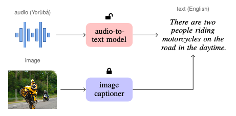

# Strim: Speech translation with images

This repository contains the code corresponding to our paper:

> Dan Oneata and Herman Kamper.
> Translating speech with just images.
> Interspeech, 2024.

The main idea of the paper is to distil the knowledge of an image captioning system into a speech paraphrasing system.
When the audio is in a foreign language the system will perform speech translation, outputting an English paraphrase.
This process is illustrated schematically in the figure below:

</img>

# Setup

The code depends on PyTorch, which we recommend installing with conda; for example:

```bash
conda create -n strim python=3.12
conda activate strim
conda install pytorch torchvision torchaudio pytorch-cuda=12.1 -c pytorch -c nvidia
```

Then you can install this code as a library with:

```bash
pip install -e .
```

# Experiments

The main steps are the following:

1. Extract image features and generate image captions:
```bash
for s in train dev test; do
    python strim/scripts/run_image_captioner.py -m blip-base -d flickr8k --split $s
done
```
2. Extract audio features:
```bash
for s in train dev test; do
    python strim/scripts/extract_audio_features.py --split $s
done
```
3. Learn the network to map audio features to corresponding generated captions:
```bash
python strim/audio_to_text/cross_attention/train.py -c flickr8k-blip-base
# or use accelerate for multi-GPU training
accelerate launch strim/audio_to_text/cross_attention/train.py -c flickr8k-blip-base
```
4. Predict using the learnt model:
```bash
python strim/audio_to_text/cross_attention/predict.py -c flickr8k-blip-base
```

Evaluation scripts are available in:
- `strim/scripts/show_bleu_metrics.py`, which generates results for Table 1 in the paper;
- `strim/scripts/show_sensitivity_analysis_captioning.py`, which generates results for Figure 5 in the paper.

# Miscellany

Apart from the cross-attention-based audio-to-text network (in `strim/audio_to_text/cross_attention`),
the repository implements two other approaches that were briefly discussed in the paper, but which gave worse results:

- **Prompt tuning** (in `strim/audio_to_text/prompt_tuning`), which maps the audio to a soft prompt to guide the decoding towards translation.
- **Audio to image mapper** (in `strim/audio_to_image`), which maps the audio to image features (instead of text) and uses those as input to a pretrained image captioning system.
